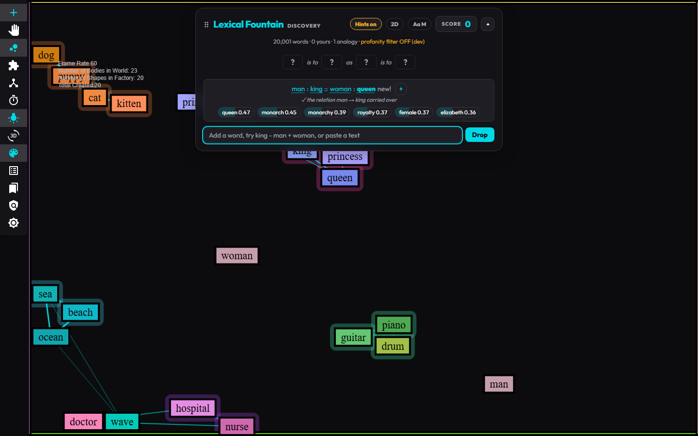
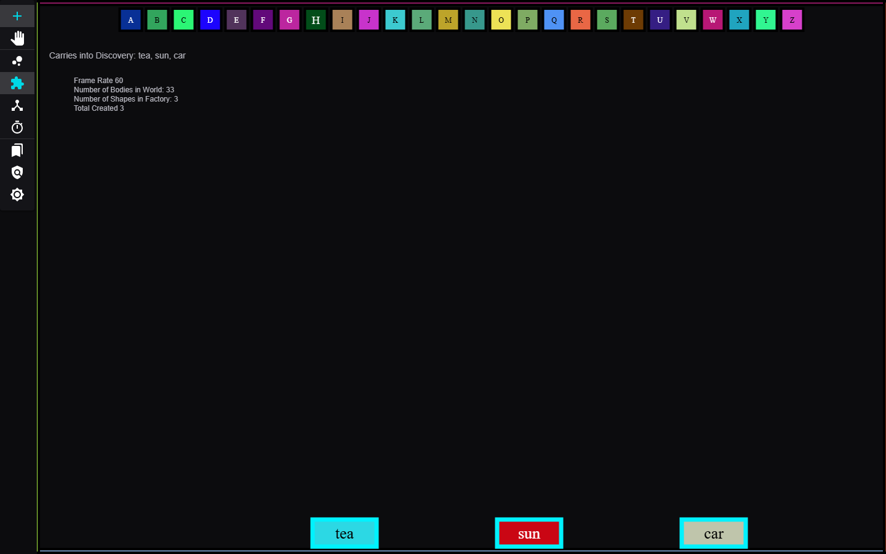
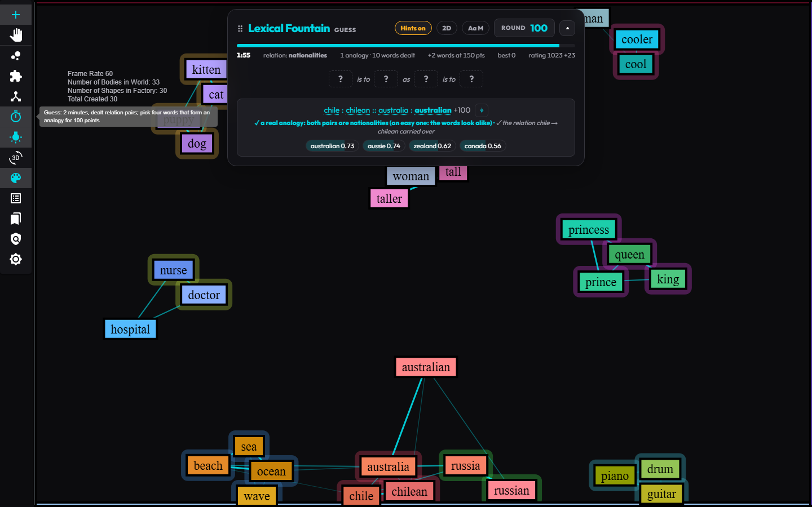
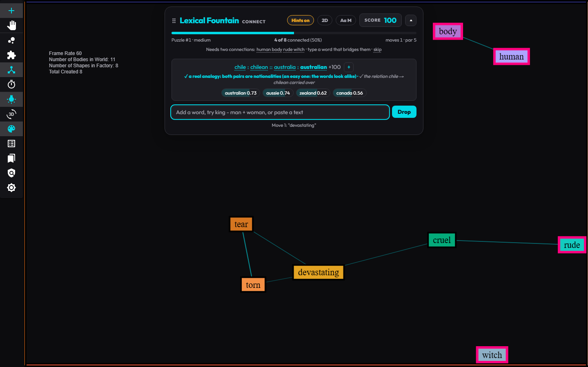
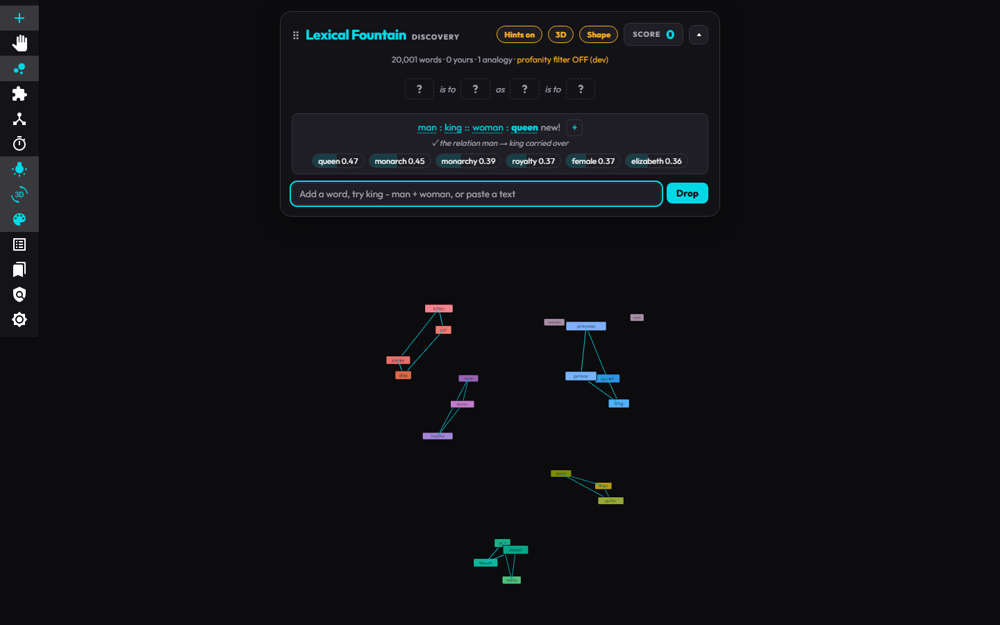
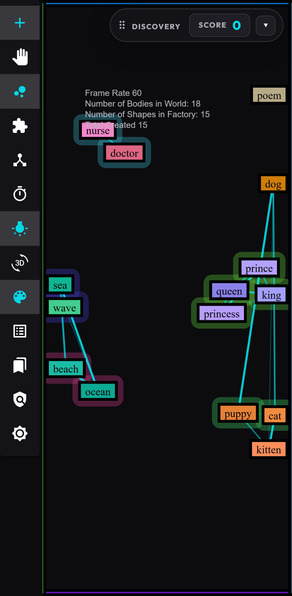

# Lexical Fountain

A word-physics playground where **distance on screen mirrors meaning**. Words are physics bodies, and a small language model (MiniLM, running in your browser) gives every word a meaning vector. Related words attract, form molecules and settle into clusters, in 2D and in an explorable 3D space. The game modes, from dropping letters to grading your analogies, teach you how embeddings "think".

**Play it**: not hosted right now (2026-10-09); run it locally with `yarn dev` (add `--host 0.0.0.0` to play from a phone on your network). It was live on SiteGround from 2026-10-05 to 10-09.



## Modes

| Mode | What you do |
|---|---|
| **Letters** (puzzle-piece icon) | The original game. Drop letters (choose them from the top bar, or sprinkle them) and they merge when they start a word. Words the model knows are outlined and listed ("Carries into Discovery: tea, sun, car"), and they come with you into the other modes. |
| **Discovery** (bubbles icon) | Free play. Pick three words, *a : b :: c*, and the model's answer lands on the board with a hint about whether the relation carried over. Type words, `king - man + woman`, or paste a text to drop its keywords. Discovery plays earn no points. |
| **Guess** (timer icon) | A 2-minute round dealt from a relation (capitals, family, comparatives, …). Pick **four** words that form an analogy: +100 for a real one (either form, *a : b :: c : d* or *a : c :: b : d*), +25 for a near miss (right pairs, one backwards), 0 otherwise. Nothing spawns, and solved words clear to make room for reward pairs. |
| **Connect** (network icon) | A puzzle: add words until every word on the board has at least two connections. Each typed word is a move; beat par (what our solver needs). Puzzles are numbered and the same everywhere. |

| Letters | Guess | Connect |
|---|---|---|
|  |  |  |

## Highlights

* **One board across modes**: words you spell in letters mode carry into Discovery and Guess, Discovery words carry into Guess, and the letter board is still there when you come back.
* **Hint mode and 3D**: with hints on, words orbit and bond by meaning, and threads link close meanings. The 3D view lays out the board's own embedding shape (lines, rings, clusters), never a ball. In 3D, **+** mode taps add words and **hand** mode rotates, pans, and zooms the view.
* **Color hints** (🎨): related meanings share a hue, so color is a second hint. Measured: color distance tracks meaning (Spearman −0.67 on a families board), and groups sit at least 60° apart on the hue wheel.
* **Skill rating per persona**: every graded guess moves an Elo-style rating, and each round deals a relation that matches it (family words for a novice, world capitals for an expert). Obvious pairs (heavy → heavier) count as easier finds than pairs that look different (bad → worse).
* **Phone-ready**: finger drags in Move mode, tap-to-dock dashboard, a zoomed-out board with a word size setting ("Aa S / M / L"), one font size for every word.
* **Saved sessions** (🔖): save a board and reload it later, download or upload sessions, and upload a downloaded play log (your plays merge, and words you added come back).
* **Accounts and sync (optional)**: play as a guest, or sign in with Google to sync across devices (several accounts per device; local test personas need no Google). Research sharing is opt-in, with an age question; export and erase all your data any time.





## How it works

* **Embeddings**: `Xenova/all-MiniLM-L6-v2` (384-d, quantized) runs in the browser. A 20,001-word vocabulary is pre-embedded at build time (`public/vocab`, committed), and new words you type are embedded on the fly.
* **Physics**: Matter.js in 2D (drawn with a small Canvas2D sketch), three.js with a custom integrator in 3D. Semantic forces are calibrated from the vocabulary's similarity percentiles, so "related" means more related than 99% of random pairs.
* **Fair scoring**: game rules are gamed out before they ship. Simulated players (skilled, half-informed, exploit, random) check that no cheap strategy beats real play: Guess grading leaves random play under 1% of skilled, and Connect's hub-word trick solves 1% of puzzles. See [`docs/research/`](docs/research/README.md).
* **Local-first**: everything is stored in your browser (IndexedDB, one database per account). Sync goes through a small API with shared, unit-tested merge rules.

<br clear="right">

## Project layout

```
src/              web app (React 18 + Vite, MobX)
  embeddings/     vector math, vocabulary index, analogy solver, calibration, profanity policy
  game/           pure game rules: relation pairs, Guess grading, rating, letters rules, Connect-All, sessions
  physics/        layout and physics models (orbital forces, 3D simulation, molecules, board zoom)
  space/          three.js 3D world          matterJsComp/   2D Matter world, dashboard, panels
  services/       use cases                  persistence/    IndexedDB repository   stores/  MobX
packages/shared/  @lexical/shared: zod DTOs and merge rules shared by the app and the server
server/           @lexical/server: Hono API (accounts, sync, export, delete) that also serves the built app
docs/research/    reports and reproducible experiments behind the design decisions
proj-mgmt/        epics, roadmap, and the owner's to-do list (human-todo/)
```

## Scripts

| Command | What it does |
|---|---|
| `yarn dev` | Vite dev server on http://localhost:41940 (this project's ports are 41940–41959, `ports.config.ts`; add `--host 0.0.0.0` to try it from a phone on your network) |
| `yarn dev:server` | the API on :41941 in watch mode (Vite proxies `/api`); local sign-in without Google |
| `yarn build` | production build into `dist/` |
| `yarn start` | the production server: the built game and `/api` on `PORT` (what Node hosting runs) |
| `yarn test:unit` | unit tests (web app, shared package, server) |
| `yarn test:e2e` | Playwright end-to-end tests, desktop and phone |
| `yarn vocab:build` | rebuild the embedded vocabulary (about 5 minutes; commit `public/vocab` afterwards) |
| `yarn research:cross-dim` | the research experiments |

Deployment: any Node.js host works the same way: install, `yarn build` (about 10 s; the vocabulary is committed), then `yarn start` on `PORT`. No host is chosen right now; environment variables are listed in [`proj-mgmt/human-todo/12-siteground-node-hosting.md`](proj-mgmt/human-todo/12-siteground-node-hosting.md) and [`server/.env.example`](server/.env.example).

## Credits

Letter frequencies for letters mode: [Cornell, English letter frequencies](http://pi.math.cornell.edu/~mec/2003-2004/cryptography/subs/frequencies.html). Analogy relations: the Google analogy test set (Mikolov et al. 2013). Embeddings: [all-MiniLM-L6-v2](https://huggingface.co/sentence-transformers/all-MiniLM-L6-v2) via Transformers.js.
