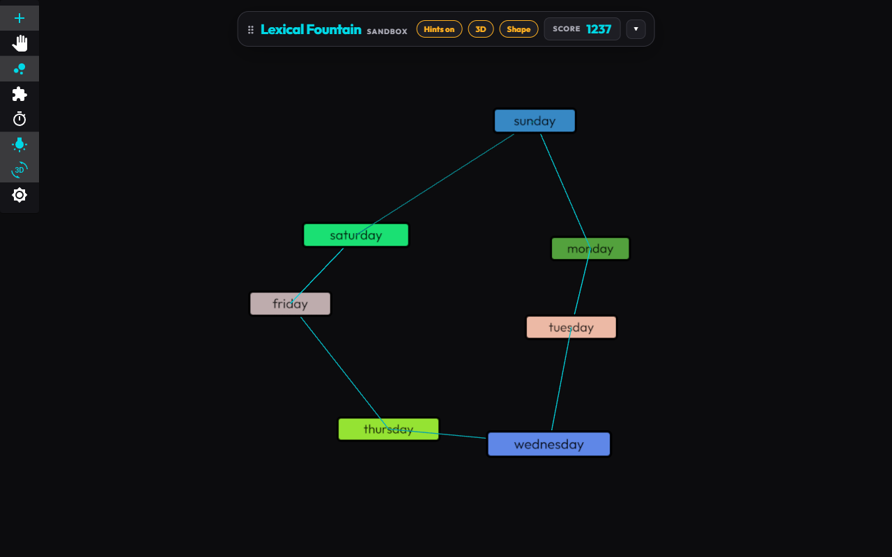
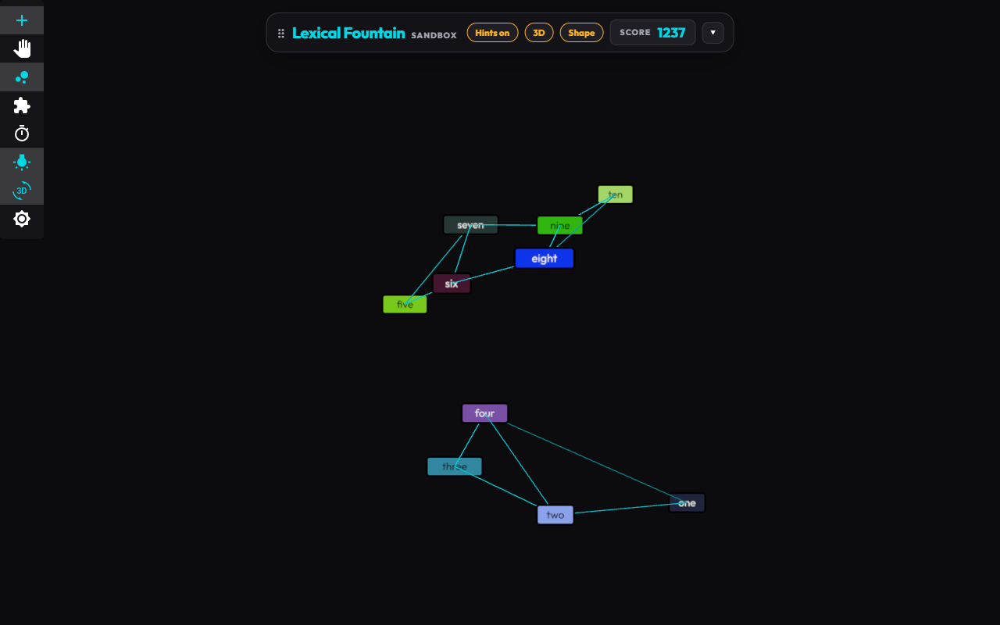
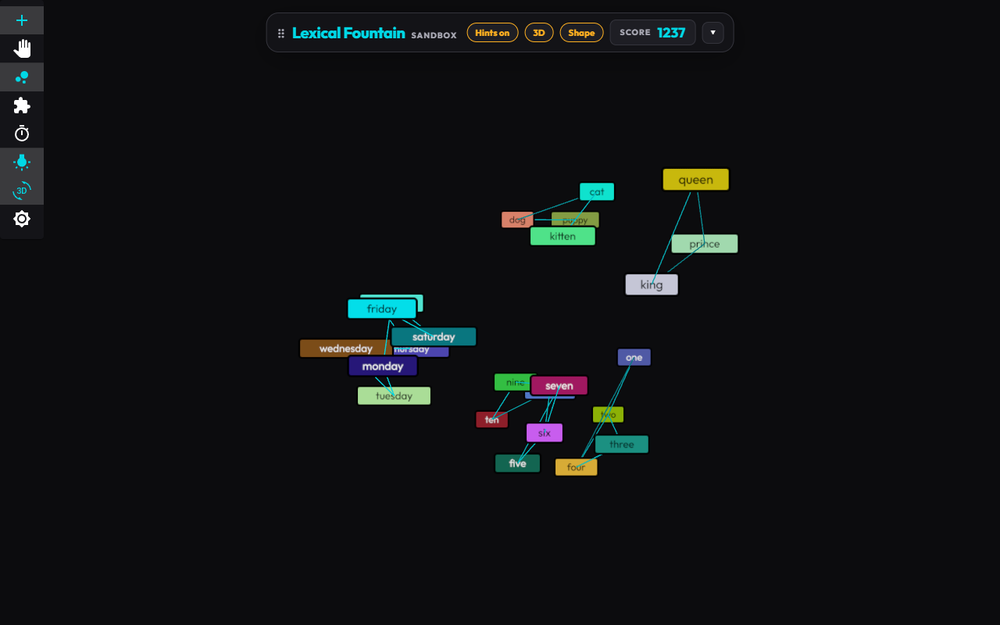
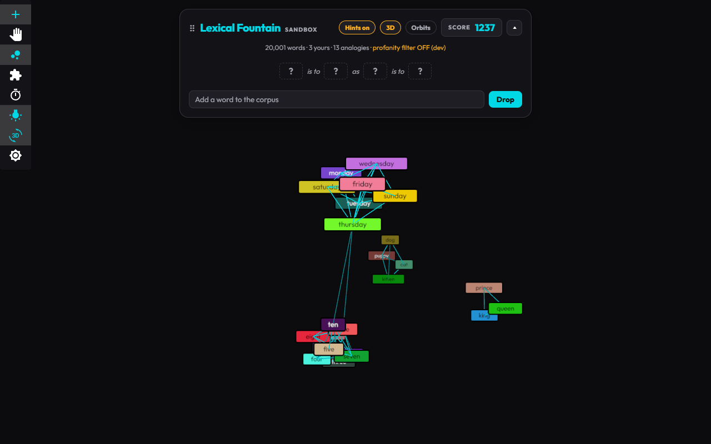
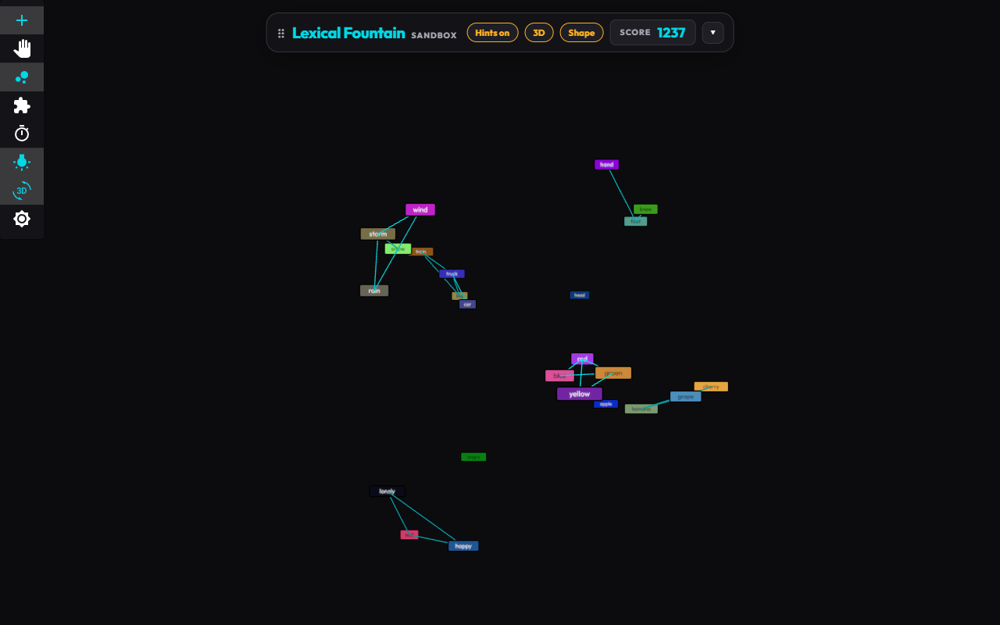
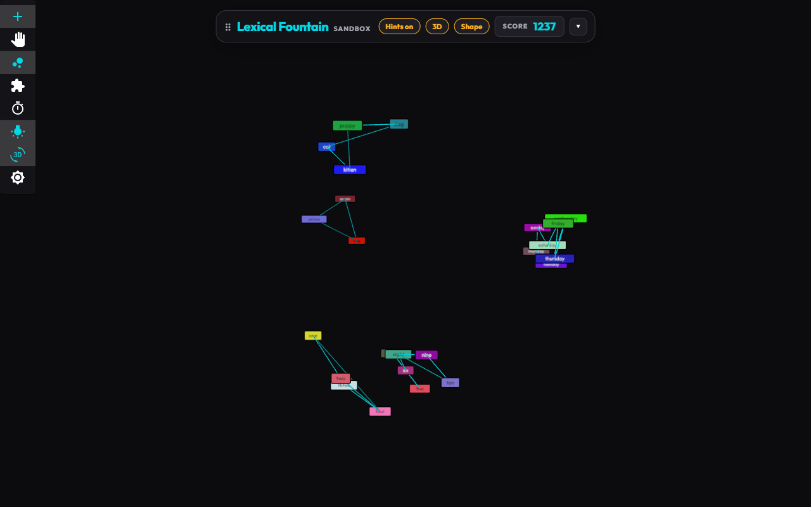

# Embedding Shape: Letting Embedding Distances Decide the 3D Configuration

**Status**: research complete, MVP shipped (3D "Shape" layout, revised after player feedback, see section 5), plan in [Epic 5 · Features 5.14–5.15](../../proj-mgmt/epic-5-3d-semantic-space.md) · **Date**: 2026-09-23 · **Reproduce**: `yarn research:cross-dim` (all research experiments; this report's data is [`experiments/results/embedding-shape.json`](experiments/results/embedding-shape.json))

## 1. Question

Every 3D hint-view board settled into roughly the same shape: a sphere. The stable configuration should instead depend on the embedding distances between the words, so the layout itself becomes a visualization (lines for ordered words, rings for cycles, clusters for families). Why is it always a sphere, and what layout model fixes it without losing fidelity?

## 2. Method

Nine boards: two hand-picked family boards, a random 30-word board, three **ordered** boards (numbers one–ten, temperature freezing → scorching, sizes tiny → enormous), two **cyclic** boards (months, days of the week), and a mix of numbers + days + temperature. Each layout model runs 1,500 physics steps (25 s at 60 Hz) from three deterministic random 3D starts. Metrics:

| Metric | Meaning |
|---|---|
| Fidelity | Spearman correlation of pair similarity vs distance (−1 = perfect map of meaning) |
| kNN@3 recall | share of each word's 3 nearest embedding neighbours that are its 3 nearest on screen |
| Radial CV | spread of distances from the centroid (≈0 = every word on one shell, i.e. a sphere) |
| Anisotropy | variance of the 3rd principal axis / 1st (≈1 = round ball, ≈0 = line or flat sheet) |
| Structure | ordered boards: order recovered along the main axis (\|Spearman\|); cyclic boards: share of consecutive items that are neighbours around the ring |

Reference: classical MDS (Torgerson 1952) of the embedding distances in 3D, i.e. the best *linear* projection.

## 3. Findings

### 3.1 The sphere is not caused by the container

The 3D simulation has a spherical boundary (radius 650). Removing it changes nothing: every metric is identical with and without it. The shape comes from the forces.

### 3.2 Two opposite failure modes

* **The calibrated model (2D-tuned percentile targets) saturates at both ends.** Everything below the 5th percentile gets the same far target and everything above similarity 0.6 the same near target. Tightly related boards collapse: days of the week score fidelity **−0.04** with the ring destroyed (0.29), months −0.08.
* **Raw embedding distance (chord distance √(2 − 2·cos)) makes the sphere *worse*** (radial CV 0.04 vs 0.10). In 384 dimensions, unrelated words are all ≈ √2 apart (distance concentration, the curse of dimensionality). A board of near-equidistant points is honestly drawn as a shell, so the sphere is partly *true*: it is what "these words are all equally unrelated" looks like.
* **The shapes exist.** Static MDS recovers numbers as an ordered line (0.98), days as a perfect ring (1.00), and elongated shapes for sizes and numbers (anisotropy 0.37–0.39). The embeddings contain the structure; each force model loses it in a different regime.

### 3.3 Board-relative targets fix both: the rank model

Two board-relative models were tested: **adaptive** (the board's chord distances min–max stretched onto [110, 720]) and **rank** (pairs spaced by the rank of their dissimilarity within the board, in the spirit of Kruskal's non-metric MDS, 1964). Both use stress-majorization forces weighted by 1/target² (Gansner, Koren & North 2004).

| Fidelity | families | dense24 | random30 | numbers | temperature | sizes | months | days | mix |
|---|---|---|---|---|---|---|---|---|---|
| MDS reference | −0.74 | −0.55 | −0.53 | −0.97 | −0.87 | −0.97 | −0.79 | −0.91 | −0.69 |
| calibrated (was default) | −0.79 | −0.74 | −0.56 | −0.86 | −0.93 | −0.88 | −0.08 | −0.04 | −0.85 |
| metric (raw distance) | −0.57 | −0.59 | −0.43 | −0.80 | −0.62 | −0.91 | −0.70 | −0.82 | −0.69 |
| adaptive | −0.61 | −0.57 | −0.54 | −0.98 | −0.79 | −0.98 | −0.81 | −0.93 | −0.75 |
| **rank** | **−0.88** | **−0.84** | **−0.64** | **−0.98** | **−0.97** | **−0.99** | −0.77 | **−0.94** | **−0.91** |

| Shape (rank vs calibrated) | families | random30 | numbers | days | months | temperature |
|---|---|---|---|---|---|---|
| Radial CV (↑ = not a shell) | 0.27 vs 0.10 | 0.28 vs 0.16 | 0.34 vs 0.43 | 0.18 vs 0.14 | 0.25 vs 0.31 | 0.53 vs 0.44 |
| Anisotropy (↓ = line/sheet) | 0.19 vs 0.61 | 0.50 vs 0.86 | 0.07 vs 0.12 | 0.00 vs 0.50 | 0.44 vs 0.75 | 0.43 vs 0.43 |
| Structure recovered | | | 0.96 vs 0.83 | **1.00 vs 0.29** | 0.48 vs 0.33 | 0.13 vs 0.43 |
| kNN@3 recall | 0.90 vs 0.86 | 0.53 vs 0.50 | 0.98 vs 0.67 | 0.76 vs 0.60 | 0.72 vs 0.36 | 0.88 vs 0.77 |

* The rank model has the best fidelity on 8 of 9 boards and the best or near-best neighbourhood recall, and it produces **distinct shapes**: numbers become a line (anisotropy 0.07), days a flat ring (0.00), families a sheet (0.19).
* Rank beats even the MDS reference on fidelity because it is non-linear: it uses the full distance range regardless of how concentrated the raw distances are.
* Keeping gentle orbits on strong links costs nothing (orbiting and still variants are within 0.02 on every metric).

### 3.4 Stability and 2D

* **Adding a word barely moves a rank layout** (correlation of pair distances before and after one word joins: 0.98–1.00), better than the calibrated model (0.51–0.99). Ranks are board-relative, but one word adds only n of ~n²/2 pairs.
* **In 2D the rank model is mixed**: much better on structured boards (days −0.03 → −0.94, numbers −0.81 → −0.98) but it collapses on the random 30-word board (−0.46 → −0.11). 435 ranked constraints cannot be satisfied in a plane. Rank is a 3D model for now.

### 3.5 In the running app (MVP)

| Board | Fidelity | Variance visible on screen |
|---|---|---|
| days of the week | −0.95 | 0.99 |
| numbers one–ten | −0.98 | 0.98 |
| numbers + days + pets + royalty (24) | −0.90 (orbits layout: −0.85) | 0.86 |

*Days of the week in the Shape layout: a ring in weekday order, traced by the nearest-neighbour skeleton.*

*Numbers: MiniLM separates one–four from five–ten, each a short chain. The layout shows the model's structure honestly, including where it is not a clean number line.*

*A mixed board: pets, royalty, days, and numbers form four distinct formations.*

*The same kind of board in the previous Orbits layout: days and numbers collapse into blobs.*

## 4. Decisions

1. **3D defaults to the rank model ("Shape")**, with a dashboard pill to compare against "Orbits". 2D stays on the calibrated model (Matter physics) until 2D rank is solved.
2. **Draw the nearest-neighbour skeleton (k = 2) in Shape mode** instead of every p99 link. Dense groups otherwise become a web of links that hides lines and rings; the skeleton makes ordered words read as chains and cycles as loops.
3. **Orient the camera to the best view**: look along the layout's least-variance principal axis (the same insight as the cross-dimension research), so shapes are seen face-on. Shape mode holds that view instead of auto-rotating.
4. **Give the shape layout a larger container** (1,400) so bounds only catch strays.

## 5. Player feedback: "still a ball of stuff" → cluster separation

**Feedback (2026-09-23)**: the 3D Shape view still looked like one ball; related groups should repel each other so the current cluster configuration is visible instead of a sphere.

**Diagnosis**: the rank model maximized fidelity but *under-separated groups*. Its stress weights (1/target²) make far-pair springs ~27× weaker than near ones, and its even rank spacing spreads within-group pairs across the whole range, so group boundaries never become gaps. Measured with the **silhouette** of known groups (1 = tight, well-separated groups) on four grouped boards ([`experiments/clusterSeparation.experiment.ts`](experiments/clusterSeparation.experiment.ts), [results](experiments/results/cluster-separation.json)):

| Model (mean of 4 boards × 3 starts) | Separation (silhouette ↑) | Fidelity (↓) | Label clutter (↓) |
|---|---|---|---|
| Orbits (calibrated) | 0.60 | −0.77 | 0.06 |
| Rank (first Shape MVP) | **0.45** | −0.86 | 0.04 |
| Rank + weaker weighting and/or separation push (best variant) | 0.51 | −0.87 | 0.03 |
| Local rank, curved, far (UMAP-style neighbourhoods) | 0.55 | −0.76 | 0.02 |
| **Grouped** (clusters, then rank within / gap between), unweighted, roomy, ~p97 grouping | **0.63** | **−0.85** | **0.02** |

* "Repel more" alone is not enough: stronger far springs or a separation push lift separation only to 0.51.
* **The layout needs to know the groups.** The grouped model clusters the board (average linkage, merging while mean similarity exceeds ~p97, the midpoint of calibrated p95 and p99), rank-spaces pairs *inside* a group over a short range (170–480) and pairs *between* groups over a far range (780–1,300). Every between-group distance exceeds every within-group one, so groups are separate formations, while within-group shape (rings, lines) and between-group meaning (related groups closer) are kept. Days still form a ring (1.00), numbers keep their order (0.94).
* **Grouping threshold matters**: at p99 related words stay apart (hand / foot+knee / head as three groups); at p95 colours and fruits merge; at ~p97 the six-group board is recovered almost exactly (colours, fruits, vehicles, weather, happy+sad+lonely, hand+foot+knee), with *apple*, *angry*, and *head* alone, words MiniLM genuinely places between groups.
* **Threads stay inside groups**: cross-group nearest-neighbour threads visually tied the separated groups back into one ball.

In the app, between-group distances average 2.6–3.7× within-group ones, and 0–1 of the group pairs overlap on screen:

*Six groups: colours beside fruits, weather beside vehicles, emotions and body parts apart; ambiguous words float between groups.*

*Pets, royalty, days, and numbers (split into one–four and five–ten) as four formations.*

## 6. Limitations and open questions

* **Antonym bending**: MiniLM places *hot* and *cold* close (antonyms share contexts), so the temperature scale bends into a horseshoe, the classic "arch effect" of MDS and PCA on gradients. The straight-axis order score (0.13) undercounts a curved order; a principal-curve score would measure it fairly, and the embedding model itself is the root cause.
* **Global vs local**: on mixed boards the rank model places related groups (days, numbers) near each other and compresses each group's internal shape; a per-group view (focus on a cluster) would show both.
* Results come from 9 boards with 3 starts each and one embedding model (all-MiniLM-L6-v2).
* 2D rank needs a different formulation (e.g. only the k nearest ranks, or local stress) before it can replace the calibrated 2D model.
* One camera cannot show every group face-on: a tight group (the days) can be seen edge-on in the whole-board best view. Scroll to zoom, or "focus on a cluster" (Task 5.14.8).
* Groups are recomputed when the board changes; a word joining can split or merge groups (not yet measured for stability like the rank model was).

## 7. References

* Torgerson, W. S. (1952). Multidimensional scaling: I. Theory and method. *Psychometrika* 17.
* Kruskal, J. B. (1964). Nonmetric multidimensional scaling: a numerical method. *Psychometrika* 29.
* Gansner, E. R., Koren, Y., & North, S. (2004). Graph drawing by stress majorization. *Graph Drawing (GD 2004)*, LNCS 3383.
* Beyer, K., Goldstein, J., Ramakrishnan, R., & Shaft, U. (1999). When is "nearest neighbor" meaningful? *ICDT 1999*, LNCS 1540. (distance concentration in high dimensions)
* Diaconis, P., Goel, S., & Holmes, S. (2008). Horseshoes in multidimensional scaling and local kernel methods. *Annals of Applied Statistics* 2(3).
