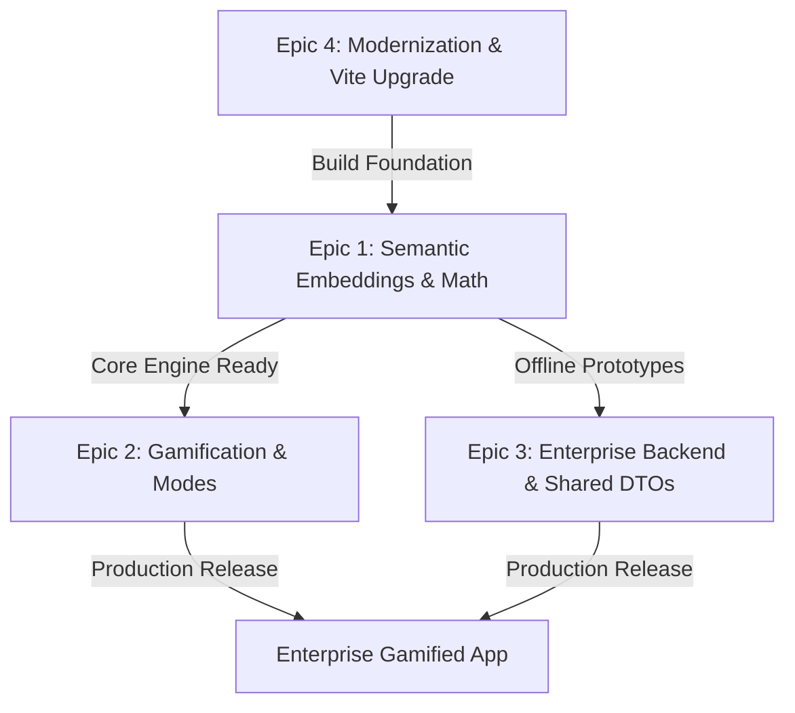

# Lexical Fountain - Master Roadmap

Welcome to the future roadmap for **Lexical Fountain** (formerly Word Physics Embeddings Game). This document outlines our transition from a primitive in-memory string-matching physics prototype to an enterprise-grade, gamified learning application and sandbox where players explore linguistic relationships through physics and semantic embeddings.

---

## 🌟 The Vision (Lexical Fountain Sandbox)

By merging a **2D rigid-body physics engine (Matter.js + p5.js)** with **word embeddings (vector semantics)**, we will build a multi-mode sandbox where language flows dynamically:
1. **Word Mode (Core)**: Dropped letters bounce and collide, merging into words when dictionary patterns are formed.
2. **Sentence Mode (Linguistic Attraction)**: Formed words attract, repel, and merge into complex sentences based on vector semantic proximity and grammar templates.
3. **Paragraph Mode (Textual Synthesis)**: Sentences cluster and fuse together to compose synthetically coherent paragraphs, driven by context embeddings and local language generation.
4. **Semantic Physics**: Words don't just collide; they attract or repel based on cosine distance. Colliding `coffee` + `milk` yields `latte`, while opposing concepts (e.g. `hot` + `cold`) cancel each other out.

---

## 🗺️ High-Level Roadmap (The Epics)

The project is deconstructed into seven Epics. Click each file link to explore detailed features, user stories, and tasks:

### 🧬 [Epic 1: Semantic Word Embeddings & Advanced Collision Engine](file:///D:/GDrive/Dev/matter-js-demo/proj-mgmt/epic-1-embeddings-collision.md)
* **Goal**: Transition from simple string concatenations to vector-based semantic similarity calculations.
* **Core Tech**: Word vectors (GloVe/Word2Vec/FastText), Cosine Similarity, Dynamic Physics Forces.
* **Key Features**: Offline/Online embeddings caching, Cosine distance scaling, similarity-based merging, semantic attraction forces.

### 🎮 [Epic 2: Gamified Language Discovery Experience](file:///D:/GDrive/Dev/matter-js-demo/proj-mgmt/epic-2-gamification.md)
* **Goal**: Formulate engaging game loops, objectives, scoring systems, and feedback systems to make learning embeddings fun.
* **Core Tech**: Matter.js bodies, custom UI overlays, visual effects (p5), connection graphs.
* **Key Features**: Discovery Mode, Survival Mode, Word Attraction Visualizer, Semantic High-Scores, Interactive Concept Tree.
* **Shipped (2026-09-24)**: paste a text to drop its keywords (Feature 2.8 MVP) and type analogies as `king - man + woman` (Feature 2.9), in 2D and 3D.
* **Shipped (2026-09-25)**: timed rounds deal designed questions (relation pairs); a play scores 100 when it completes a dealt pair, −10 when it falls back onto the first pair; every analogy shows a learning hint (Feature 2.11, [research](file:///D:/GDrive/Dev/matter-js-demo/docs/research/analogy-scoring.md)).
* **Roadmap**: voice input: a mic toggle turns speech into word blocks in 2D and 3D (Feature 2.7); text import: paste a block of text and its keywords land on the board, with website import by URL via the backend (Feature 2.8, Epic 3 · Story 3.2.3); analogy expressions: type `king - man + woman` to play an analogy (Feature 2.9); relation scoring: timed-game points only when the answer really completes the analogy (connects to the third word), gamed out in [research](file:///D:/GDrive/Dev/matter-js-demo/docs/research/analogy-scoring.md) (Feature 2.11); Connect-All puzzles: connect every word to at least two others, with rules balanced by bot simulation and puzzles generated by permutation (Feature 2.10).

### 🏢 [Epic 3: Enterprise Architecture & Backend Transition](file:///D:/GDrive/Dev/matter-js-demo/proj-mgmt/epic-3-enterprise-architecture.md)
* **Goal**: Scale the monolithic frontend to a clean, DRY monorepo structure with a backend service, shared type definitions, and proper state management.
* **Core Tech**: a thin TypeScript API (Hono) on GCP Cloud Run + Postgres (decided by [research](file:///D:/GDrive/Dev/matter-js-demo/docs/research/platform-plan.md) 2026-09-25; NestJS superseded), zod schemas as shared DTOs, MobX 6 state architecture.
* **Next**: research telemetry ingest with consent (Feature 3.6), then the sync API (Feature 3.7).
* **Key Features**: Client-Server Separation, `/shared` DTO Package, API Cache & Vector Storage, Domain-Driven Frontend Structure.

### ⚡ [Epic 4: Modernization & Dependency Upgrades](file:///D:/GDrive/Dev/matter-js-demo/proj-mgmt/epic-4-modernization.md)
* **Goal**: Modernize the build stack, upgrade key libraries, and establish a robust developer experience.
* **Core Tech**: Vite, React 18+, MobX 6, MUI 5+, Strict TypeScript.
* **Key Features**: Migrate from CRA to Vite, Upgrade p5/Matter-js bindings, Resolve MobX experimental decorators, Strict type safety.

### 🪐 [Epic 5: 3D Semantic Space](file:///D:/GDrive/Dev/matter-js-demo/proj-mgmt/epic-5-3d-semantic-space.md)
* **Goal**: Lift the hint-mode orbital layout into an explorable 3D space where distance mirrors meaning.
* **Core Tech**: three.js (lazy-loaded), custom 3D integrator, all-pairs similarity layout.
* **Key Features**: All-pairs layout (2D first), 3D orbits, raycast selection, 2D ↔ 3D toggle gated on hint mode.
* **Shipped**: embedding-shaped 3D layout ([research](file:///D:/GDrive/Dev/matter-js-demo/docs/research/embedding-shape.md)): lines, rings, and clusters from the board's own embedding distances; focus on new words, HUD analogy links, and an "Analogies on this board" menu that focuses in 2D and 3D (Feature 5.16).
* **Next**: cross-dimension continuity without re-rendering ([research](file:///D:/GDrive/Dev/matter-js-demo/docs/research/cross-dimension-continuity.md)), selection metadata HUD, live drag with physics, Create mode in 3D, zoom, spin to detangle, saved views, color hint mode (semantic colours by group and molecule, 2D and 3D, Feature 5.17).

---

### 🔐 [Epic 6: Accounts, Consent & Privacy](file:///D:/GDrive/Dev/matter-js-demo/proj-mgmt/epic-6-accounts-privacy.md)
* **Goal**: Optional accounts on top of local-first play, and the consent, age screening, pseudonymous ids, export, and deletion that let real plays be collected for research.
* **Core Tech**: Firebase Authentication / Identity Platform (Google + email link), a local `meta` store, a MobX `ConsentStore`.
* **Next (Stage A)**: per-device counters, key normalization, consent and age UI, local export and erase.

### 🚀 [Epic 7: Delivery & Operations](file:///D:/GDrive/Dev/matter-js-demo/proj-mgmt/epic-7-delivery-operations.md)
* **Goal**: CI on every PR, previews, a public production site, monitoring, and rollback, within the workspace security standards.
* **Core Tech**: GitHub Actions, Cloudflare Workers static assets, GCP Workload Identity Federation + Secret Manager, Sentry, UptimeRobot.
* **Next (Stage A)**: `ci.yml` with the vocabulary cache, an e2e build mode, and guards; branch ruleset.

---

## 🌍 Path to Public Launch (researched 2026-09-25, [platform plan](file:///D:/GDrive/Dev/matter-js-demo/docs/research/platform-plan.md))
| Stage | Ships | Cost |
|---|---|---|
| A. Local hardening | per-device counters, consent + age UI, local export/erase (Epic 6); CI on PRs (Epic 7) | $0 |
| B. Public static launch | Cloudflare hosting + previews, cache headers, Sentry v11, uptime (Epic 7) | ~$1–2/mo |
| C. Research telemetry | Cloud Run ingest + Postgres + Parquet with consent (Epic 3 · 3.6) | ~$0–12/mo |
| D. Accounts & sync | Firebase Auth, claim on sign-in, sync API, export/delete (Epics 6, 3 · 3.7) | + ~$0 |
| E. Competitive & social | server-verified leaderboards, saved views, URL import, molecule research | ~$35–70 at 100k MAU |

Open decisions D1–D10 (hosting, database, region, domain, age policy, research data scope, retention) are in the platform plan §5.

---

## 🚀 Execution Strategy

### Status snapshot (2026-09-23)
* **Phase 1 (Foundation)**: done (Epic 4 mostly complete; follow-ups in Feature 4.5).
* **Phase 2 (Semantic Engine)**: done in a different shape than planned: MiniLM vocabulary + live encoder, analogy solver, calibrated similarity (Epic 1 status note).
* **Phase 3 (Gameplay & UI)**: sandbox, timed game, hint mode, molecules, themes, accessible UI shipped (Epic 2 · Feature 2.6); the 3D semantic space (Epic 5) went beyond the original plan: toggle, embedding-shaped grouped layout, research-driven, plus focus and board analogies (5.16).
* **Phase 4 (Backend Integration)**: local-first persistence shipped and sync-ready (Epic 3 · Feature 3.5); PWA and sync server not started.
* **Next candidates**: molecule gravity & accretion (5.15, needs 3D molecules 5.4.1.5), cross-dimension continuity (5.10), 2D scroll zoom and pan (5.7.1, also lets 2D focus pan to off-screen words), selection metadata HUD (5.11), live drag with physics (5.12), PWA (3.5.3).
* **Research that drives plans**: [docs/research/](file:///D:/GDrive/Dev/matter-js-demo/docs/research/README.md).

### Development Phases
1. **Phase 1 (Foundation)**: Upgrade package dependencies and build systems (Vite, React 18, MobX 6) to establish a clean compiler environment.
2. **Phase 2 (Semantic Engine)**: Integrate the word embeddings dataset and update collision resolution logic with cosine similarity mathematics.
3. **Phase 3 (Gameplay & UI)**: Create the game loops, scoring, and particle/visual feedback systems.
4. **Phase 4 (Backend Integration)**: Stand up the backend server, migrate the database/dictionary resources, and integrate shared DTOs.
